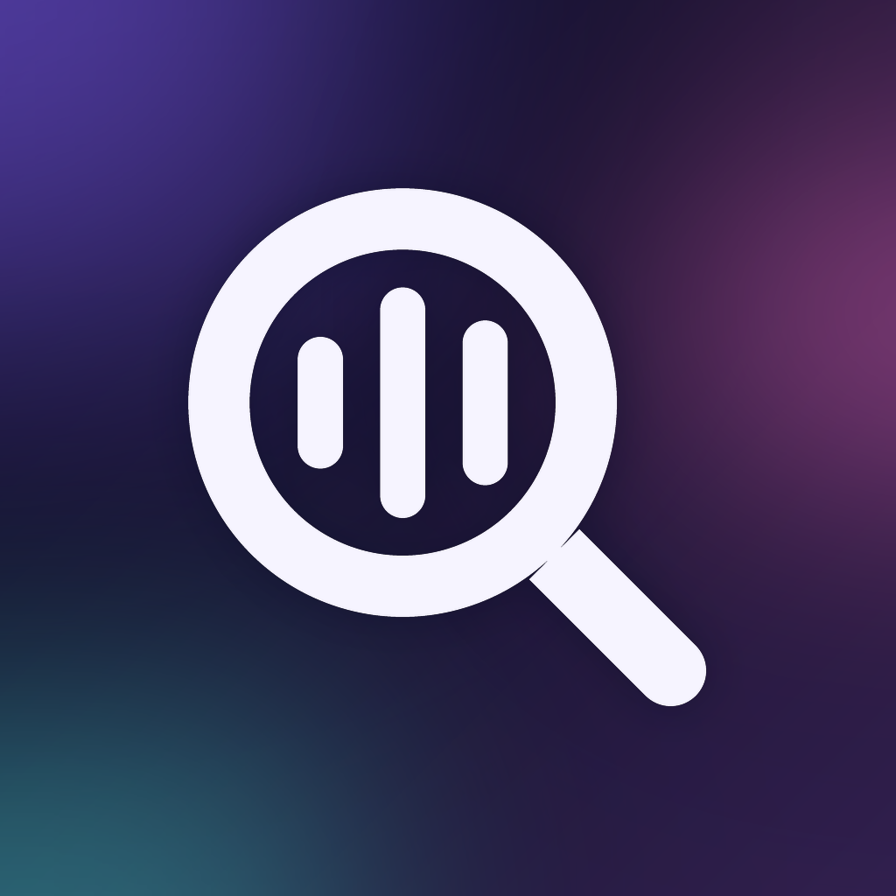

# Sound Detective 🔍

**Find the source of every mysterious sound on your phone.**

Android tracks notifications, media sessions, audio playback, foreground apps, and system events completely separately — none of it is correlated. Sound Detective watches all of it in the background and, when you hear an unexplained beep, chime, or buzz, tells you the most likely cause with a confidence score and a plain-English reason.

<p align="center">
  
</p>

## How it works

1. **Native collectors** run inside a persistent Android foreground service, watching notifications, media sessions, audio playback, Bluetooth/USB/battery/network/screen/volume/ringer state, and more.
2. Every observation becomes a `SoundEvent` and streams into Flutter, which stores it in a local Drift (SQLite) database.
3. Tap **"I JUST HEARD A SOUND"** (or the Quick Settings tile) and the app:
   - reconstructs which app was in the foreground during the last 30 seconds,
   - pulls every event in that window,
   - runs them through a deterministic, rule-based scoring engine — no network calls, no LLM.
4. You get a ranked answer with a confidence percentage, a breakdown of *why*, and device-state context (ringer mode, screen, audio stream). If nothing scores confidently enough, it honestly says **Unknown** instead of guessing.
5. Mark a result 👍/👎 — feedback is saved alongside the result so you can spot patterns in what the detective gets wrong.

## Features

- **Detective Mode** — one button, one answer. Reconstructs the last 30 seconds and ranks candidate causes by a transparent scoring breakdown.
- **Timeline** — chronological log of every raw event the background service has collected.
- **History** — every past Detective Mode answer, with your correct/incorrect feedback attached.
- **Quick Settings tile** — jump straight into an analysis from the notification shade, no need to open the app first.
- **Reliability** — a boot receiver and a periodic WorkManager watchdog restart the background service if the OS or an OEM battery manager kills it.
- **Honesty over confidence** — silent notifications, unattributed audio signals, and muted-ringer states are all called out explicitly rather than folded into a falsely-confident guess.
- **Glassmorphism UI** — frosted glass cards over a gradient background, generated app icon + notification icon to match.

## What it watches

| Tier | Source | Needs |
|---|---|---|
| A | Battery/charging, headphones, Bluetooth, USB, Wi-Fi/mobile network, screen on/off, rotation, volume, Do Not Disturb, ringer mode, next-alarm-clock changes | Standard broadcast/system permissions |
| B | Notifications posted (with silent-vs-audible detection), active media sessions, audio playback by stream type | **Notification access** (Settings) |
| C | Foreground app at the time of the sound, reconstructed on demand via `UsageStatsManager` | **Usage access** (Settings) |

Tier B is the core signal — it's the only tier that can name *which app* caused a sound. Tiers A and C add corroborating context. See [`ScoringConfig`](lib/domain/scoring/scoring_config.dart) for exactly how each signal is weighted, including why unattributed audio (Android has no public API to name which app is playing a given audio stream) is deliberately weighted below named signals.

## Project structure

```
lib/
├── main.dart                 # Real app entry point
├── app/                      # App shell, routing, Riverpod provider wiring
├── core/constants/           # Platform channel name constants (mirrored in Kotlin)
├── data/
│   ├── models/                # SoundEvent — the one event shape used everywhere
│   ├── local/                 # Drift database, tables, DAOs
│   └── repositories/          # Event ingestion + history persistence
├── domain/scoring/            # Pure Dart, zero platform dependency, fully unit-tested
│   ├── models/                 # AnalysisResult, ScoredCandidate, DeviceStateSnapshot
│   ├── rules/                  # One file per scoring rule
│   ├── scoring_config.dart     # All weights/thresholds, centralized
│   └── scoring_engine.dart     # Ties the rules together
├── features/
│   ├── detective/              # Main screen: button, result card, feedback
│   ├── history/                # Past results browser
│   ├── timeline/                # Raw event browser
│   └── onboarding/              # First-launch permission setup flow
├── platform/                  # Dart-side platform channel bridge
├── shared/                    # Glassmorphism design system (theme, glass widgets)
└── dev/preview_main.dart      # Throwaway web-preview entry point (not shipped)

android/app/src/main/kotlin/com/example/sound_detective/
├── model/SoundEvent.kt        # Mirrors the Dart model, field for field
├── core/EventBus.kt           # Single event pipeline every collector publishes into
├── channel/                   # MethodChannel/EventChannel handlers
├── collectors/
│   ├── tierA/                  # Broadcast receivers + system observers
│   ├── tierB/                  # Notification/media/audio collectors
│   └── tierC/                  # On-demand foreground-app reconstruction
├── service/                   # Foreground service, notification listener, boot receiver,
│                               # watchdog, Quick Settings tile
└── permissions/                # Centralized permission grant-checking

test/
├── domain/scoring/            # Scoring engine unit tests (synthetic event fixtures)
└── widget_test.dart           # App-shell smoke test with mocked platform channels
```

The one unified `SoundEvent` shape flows through everything: native collector → `EventBus` (Kotlin) → `EventChannel` → `EventRepository` (Dart) → Drift → `ScoringEngine`. Persistence lives only on the Dart side; native never keeps its own database, so there's a single source of truth.

## Platform notes

Sound Detective is **Android-only by design** — the core signals (`NotificationListenerService`, `AudioPlaybackCallback`, `MediaSessionManager`, `UsageStatsManager`, Quick Settings tiles) don't exist on iOS, desktop, or web. The repo still carries Flutter's default `ios/`, `web/`, `linux/`, `macos/`, `windows/` scaffolding, but none of it is part of the real app — `lib/dev/preview_main.dart` exists purely so the UI can be eyeballed in a browser with platform channels mocked out.

## Getting started

**Prerequisites:** Flutter SDK (3.41+), Android SDK, a physical device or emulator (physical strongly recommended — Bluetooth/USB/notification traffic is hard to simulate realistically).

```bash
flutter pub get
dart run build_runner build --delete-conflicting-outputs   # generates Drift code
flutter run
```

On first launch you'll be guided through granting Notification access, Usage access, and Bluetooth permission (battery optimization exemption is offered but optional).

### Testing

```bash
flutter analyze
flutter test
```

The scoring engine is pure Dart and fully unit-tested against synthetic event fixtures (clear winners, silent notifications, unattributed-audio false-positive regression, empty windows, low-confidence fallback to `Unknown`). Everything else — broadcast receivers, the notification listener, media/audio collectors, foreground-service durability — is real OS integration that can't be meaningfully unit-tested; it needs a manual on-device pass.

### Regenerating app icons

Launcher icons are generated from a Python/Pillow script (not checked into the repo as a build step, run manually when the design changes), then piped through `flutter_launcher_icons`:

```bash
dart run flutter_launcher_icons
```

## Tech stack

- **Flutter** + **Riverpod** for state management
- **Drift** (SQLite) for local storage — time-range event queries and rolling-window pruning
- **Kotlin** native Android services, `MethodChannel`/`EventChannel` platform bridge
- **WorkManager** for background service reliability

## Known limitations

- Alarm events are best-effort: Android has no public broadcast for "an alarm fired in another app," only `ACTION_NEXT_ALARM_CLOCK_CHANGED` ("next scheduled alarm changed").
- Audio playback detected via `AudioPlaybackCallback` can never be attributed to a specific app — `AudioPlaybackConfiguration.getClientUid()`/`isActive()` are `@SystemApi`, hidden from third-party apps entirely. Only `MediaSessionCollector` (Tier B) can name an app for audio.
- Publishing with Accessibility Service-based collection (a possible future Tier D) carries real Google Play policy risk and isn't implemented.
